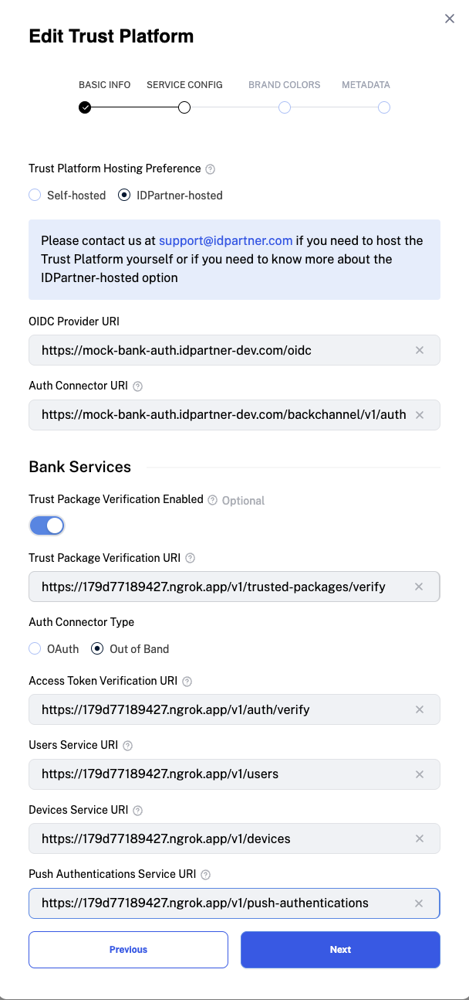

# Configuring the trust-platform-services

Follow steps below to configure the section [services.trust-platform-services](../docker-compose.yml) in the docker compose file.

## Web, redirect-based flow
1. [Register the Identity Provider](https://docs.idpartner.com/documentation/identity-provider-user-guide/registering-the-trust-platform)
   1. Grab the value of the [TRUST_PLATFORM_SERVICE_URL](../docker-compose.yml), add the suffix `/oidc` to it and use it as the `OIDC Provider URI`.
   1. Grab the value of the [TRUST_PLATFORM_SERVICE_URL](../docker-compose.yml), add the suffix `/auth-adapter/v1/auth` to it and use it as the `Authentication Connector URI`.
   1. Example:
   

1. Replace the occurrences of `{{CHANGE_ME-CLIENT_ID}}` with the Client ID configured in [Configuring the bank-services](configuring-bank-services.md).
1. Replace the occurrences of `{{CHANGE_ME-CLIENT_SECRET}}` with the Client Secret configured in [Configuring the bank-services](configuring-bank-services.md).

Depending on your integration follow instructions below to configure either OAuth2 or OIDC.

#### Configuring OAuth2
1. Set `{{AUTH_ADAPTER_OAUTH_PROTOCOL}}` to `oauth2` in in the [.env file](../.env).
1. Configure endpoint to start authorization flow. Set `AUTH_ADAPTER_OAUTH_AUTHORIZATION_PATH` to `/auth`.
1. Configure endpoint to fetch user info. Set `AUTH_ADAPTER_OAUTH_USERINFO_PATH` to `/me`.
1. Configure endpoint to get access tokens. Set `AUTH_ADAPTER_OAUTH_TOKEN_PATH` to `/token`.
1. [Optional] [PKCE](https://oauth.net/2/pkce/#:~:text=PKCE%20(RFC%207636)%20is%20an,is%20using%20a%20client%20secret.) is enabled by default. If you need to disable it set `{{OAUTH_PKCE_ENABLED}}` to `false` in the [.env file](../.env).

#### Configuring OIDC
1. Set `{{AUTH_ADAPTER_OAUTH_PROTOCOL}}` to `oidc` in in the [.env file](../.env).
1. [Optional] Remove `AUTH_ADAPTER_OAUTH_USERINFO_PATH`, `AUTH_ADAPTER_OAUTH_TOKEN_PATH` and `AUTH_ADAPTER_OAUTH_AUTHORIZATION_PATH` env vars.
1. [Optional] [PKCE](https://oauth.net/2/pkce/#:~:text=PKCE%20(RFC%207636)%20is%20an,is%20using%20a%20client%20secret.) is enabled by default. If you need to disable it set `{{OAUTH_PKCE_ENABLED}}` to `false` in the [.env file](../.env).

Note: The endpoints for `AUTH_ADAPTER_OAUTH_USERINFO_PATH`, `AUTH_ADAPTER_OAUTH_TOKEN_PATH` and `AUTH_ADAPTER_OAUTH_AUTHORIZATION_PATH` are inferred using the OIDC well known endpoint.

## Mobile, push-authentication-based flow
1. [Register the Identity Provider](https://docs.idpartner.com/documentation/identity-provider-user-guide/registering-the-trust-platform)
   1. Grab the value of the [TRUST_PLATFORM_SERVICE_URL](../docker-compose.yml), add the suffix `/oidc` to it and use it as the `OIDC Provider URI`.
   1. Grab the value of the [TRUST_PLATFORM_SERVICE_URL](../docker-compose.yml), add the suffix `/backchannel/v1/auth` to it and use it as the `Authentication Connector URI`.
   1. Example:
   

1. Replace the occurrences of `{{CHANGE_ME-MOBILE_APP_URL}}` in the [.env file](../.env) with the iOS mobile app URL. For example `idpartner://idpartner-future-bank`.
1. [Optional] Update the value of `BANK_USERS_SERVICE_API` to the Users Service URL.
1. [Optional] Update the value of `BANK_DEVICES_SERVICE_API` to the Devices Service URL.
1. [Optional] Update the value of `BANK_PUSH_AUTHENTICATIONS_SERVICE_API` to the Push Authentications Service URL.
1. [Optional] Update the value of `BANK_TRUSTED_PACKAGE_VERIFICATION_API` to the Trust Package Verification Service URL.

By default the `BANK_USERS_SERVICE_API`, `BANK_DEVICES_SERVICE_API`, `BANK_PUSH_AUTHENTICATIONS_SERVICE_API` and `BANK_TRUSTED_PACKAGE_VERIFICATION_API` point to the `bank-services` running locally. Update them to integrate with a custom implementation.

## Optional configuration for both web and mobile flows
1. [Optional] Configure Error Reporting. [Sign up to Sentry](https://sentry.io/signup/), create a DSN and set it to `SENTRY_DSN`.

## Next steps
Go to [Running the Trust Platform](running-trust-platform.md).
