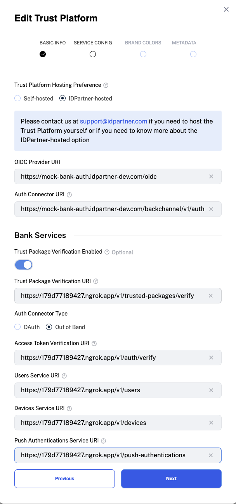

# Configuring the Trust Platform Services
Follow the steps below to configure the IDPartner-hosted Trust Platform Services. Begin by establishing a secure tunnel to your `bank-services`:

1. Start an SSL tunnel to the `bank-services` by running `ngrok http 9702` in your terminal.

You will need the Bank Services URL later on. Keep it handy.

## Web, redirect-based flow
1. [Register the Identity Provider](https://docs.idpartner.com/documentation/identity-provider-user-guide/registering-the-trust-platform)
   1. Choose `IDPartner-hosted` as `Hosting Preference`
   1. Obtain the value of [TRUST_PLATFORM_SERVICES_URL](../.env), append `/oidc` to it, and use this as the `OIDC Provider URI`.
   1. Obtain the value of [TRUST_PLATFORM_SERVICES_URL](../.env), append `/auth-adapter/v1/auth` to it, and use this as the `Authentication Connector URI`.
   1. [Optional] Activate `Trust Package Verification Enabled` if needed. For Trust Package Verification, append `/v1/trusted-packages/verify` to the full `bank-services` ngrok URL (e.g., `https://subdomain.ngrok.io`) and use it as the `Trust Package Verification URI`.
2. Replace `{{CHANGE_ME-CLIENT_ID}}` in the `.env` file with the Client ID set in [Configuring the Bank Services](configuring-bank-services.md).
3. Replace `{{CHANGE_ME-CLIENT_SECRET}}` in the `.env` file with the Client Secret set in [Configuring the Bank Services](configuring-bank-services.md).

Depending on your integration follow instructions below to configure either OAuth2 or OIDC.

#### Configuring OAuth2
1. Select `OAuth` as `Auth Connector Type`
1. Select `OAuth2` as `Auth Protocol`
1. Copy the full `bank-services` ngrok URL (e.g., `https://subdomain.ngrok.io`), append `/oauth2` and use it as the `Auth Server URI`
1. Set `/token` as `OAuth Token Path`
1. Set `/auth` as `OAuth Authorization Path`
1. Set `/me` as `OAuth User Info Path`

Configuration example: 

#### Configuring OIDC
1. Select `OAuth` as `Auth Connector Type`
1. Select `OIDC` as `Auth Protocol`
1. Copy the full `bank-services` ngrok URL (e.g., `https://subdomain.ngrok.io`), append `/oauth2` and use it as the `Auth Server URI`

Configuration example: 

## Mobile, push-authentication-based flow
1. [Register the Identity Provider](https://docs.idpartner.com/documentation/identity-provider-user-guide/registering-the-trust-platform)
   1. Select `IDPartner-hosted` as `Hosting Preference`
   1. Obtain the value of [TRUST_PLATFORM_SERVICES_URL](../.env), append `/oidc` to it, and use this as the `OIDC Provider URI`.
   1. Obtain the value of [TRUST_PLATFORM_SERVICES_URL](../.env), append `/backchannel/v1/auth` to it, and use this as the `Authentication Connector URI`.
   1. [Optional] Activate `Trust Package Verification Enabled` if needed. For Trust Package Verification, append `/v1/trusted-packages/verify` to the full `bank-services` ngrok URL (e.g., `https://subdomain.ngrok.io`) and use it as the `Trust Package Verification URI`.
   1. Copy the full `bank-services` ngrok URL (e.g., `https://subdomain.ngrok.io`), append `/v1/auth/verify` and use it as the `Access Token Verification URI`
   1. Copy the full `bank-services` ngrok URL (e.g., `https://subdomain.ngrok.io`), append `/v1/users` and use it as the `Users Service URI`
   1. Copy the full `bank-services` ngrok URL (e.g., `https://subdomain.ngrok.io`), append `/v1/devices` and use it as the `Devices Service URI`
   1. Copy the full `bank-services` ngrok URL (e.g., `https://subdomain.ngrok.io`), append `/v1/push-authentications` and use it as the `Push Authentications Service URI`
   - For example:
   
1. Replace `{{CHANGE_ME-MOBILE_APP_URL}}` in the `.env` file with your iOS mobile app URL, e.g., `idpartner://idpartner-future-bank`.

## Optional configuration for both web and mobile flows
1. [Optional] For error reporting, [sign up for Sentry](https://sentry.io/signup/), create a DSN, and set `SENTRY_DSN` in the `.env` file.

## Next steps
Go to [Running the Bank Services](running-bank-services.md).
