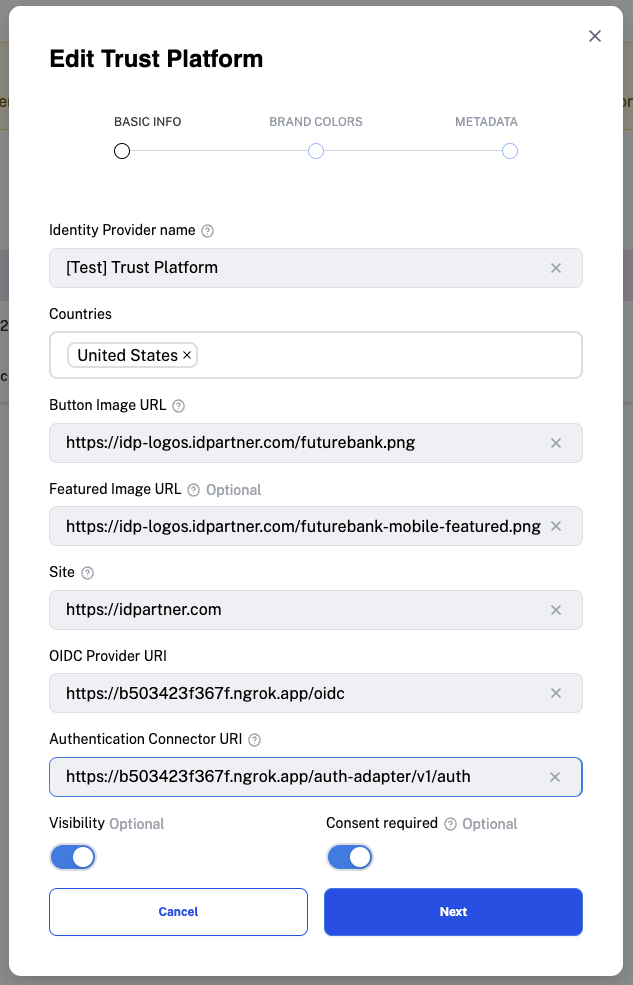

# Configuring the Trust Platform Services
Follow the steps below to configure the `services.trust-platform-services` section in the `docker-compose.yml` file.

## Web, redirect-based flow
1. [Register the Identity Provider](https://docs.idpartner.com/documentation/identity-provider-user-guide/registering-the-trust-platform)
   - Obtain the value of `[TRUST_PLATFORM_SERVICES_URL](../.env)`, append `/oidc` to it, and use this as the `OIDC Provider URI`.
   - Obtain the value of `[TRUST_PLATFORM_SERVICES_URL](../.env)`, append `/auth-adapter/v1/auth` to it, and use this as the `Authentication Connector URI`.
   - For example:
   

2. Replace `{{CHANGE_ME-CLIENT_ID}}` in the `.env` file with the Client ID set in [Configuring the Bank Services](configuring-bank-services.md).
3. Replace `{{CHANGE_ME-CLIENT_SECRET}}` in the `.env` file with the Client Secret set in [Configuring the Bank Services](configuring-bank-services.md).

Depending on your integration follow instructions below to configure either OAuth2 or OIDC.

#### Configuring OAuth2
1. Set `{{AUTH_ADAPTER_OAUTH_PROTOCOL}}` to `oauth2` in the `.env` file.
1. Define the authorization endpoint by setting `AUTH_ADAPTER_OAUTH_AUTHORIZATION_PATH` to `/auth`.
1. Define the user info endpoint by setting `AUTH_ADAPTER_OAUTH_USERINFO_PATH` to `/me`.
1. Define the access token endpoint by setting `AUTH_ADAPTER_OAUTH_TOKEN_PATH` to `/token`.
1. [Optional] [PKCE](https://oauth.net/2/pkce/#:~:text=PKCE%20(RFC%207636)%20is%20an,is%20using%20a%20client%20secret.) is enabled by default. To disable it, set `{{OAUTH_PKCE_ENABLED}}` to `false` in the `.env` file.

#### Configuring OIDC
1. Set `{{AUTH_ADAPTER_OAUTH_PROTOCOL}}` to `oidc` in the `.env` file.
1. [Optional] For OIDC, you may remove `AUTH_ADAPTER_OAUTH_USERINFO_PATH`, `AUTH_ADAPTER_OAUTH_TOKEN_PATH`, and `AUTH_ADAPTER_OAUTH_AUTHORIZATION_PATH` environment variables, as these endpoints are inferred from the OIDC well-known endpoint.
1. [Optional] [PKCE](https://oauth.net/2/pkce/#:~:text=PKCE%20(RFC%207636)%20is%20an,is%20using%20a%20client%20secret.) is enabled by default. To disable it, set `{{OAUTH_PKCE_ENABLED}}` to `false` in the `.env` file.

## Mobile, push-authentication-based flow
1. [Register the Identity Provider](https://docs.idpartner.com/documentation/identity-provider-user-guide/registering-the-trust-platform)
   - Obtain the value of `[TRUST_PLATFORM_SERVICES_URL](../.env)`, append `/oidc` to it, and use this as the `OIDC Provider URI`.
   - Obtain the value of `[TRUST_PLATFORM_SERVICES_URL](../.env)`, append `/backchannel/v1/auth` to it, and use this as the `Authentication Connector URI`.
   - For example:
   
1. Replace `{{CHANGE_ME-MOBILE_APP_URL}}` in the `.env` file with your iOS mobile app URL, e.g., `idpartner://idpartner-future-bank`.
1. [Optional] Update the `BANK_USERS_SERVICE_API`, `BANK_DEVICES_SERVICE_API`, `BANK_PUSH_AUTHENTICATIONS_SERVICE_API`, and `BANK_TRUSTED_PACKAGE_VERIFICATION_API` values to integrate with your custom implementation, if not using the local `bank-services`.

## Optional configuration for both web and mobile flows
1. [Optional] For error reporting, [sign up for Sentry](https://sentry.io/signup/), create a DSN, and set `SENTRY_DSN` in the `.env` file.

## Next steps
Go to [Running the Trust Platform](running-trust-platform.md).
